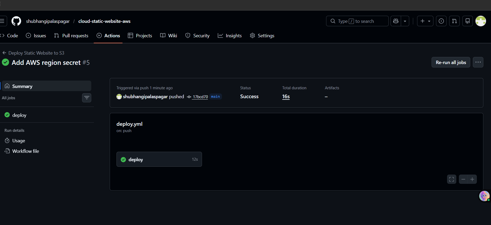
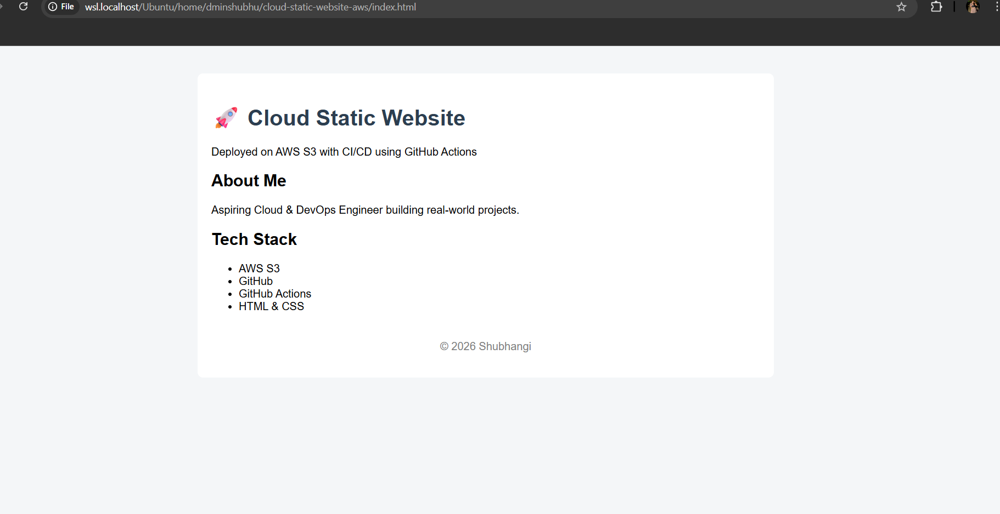
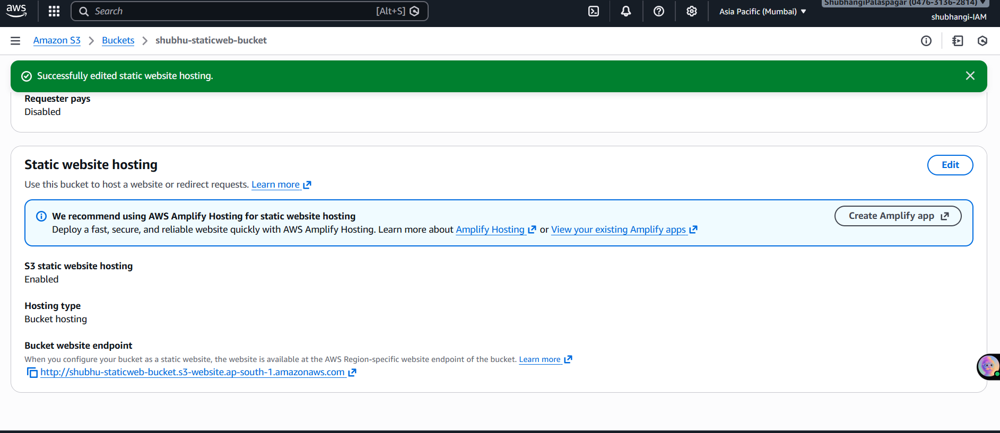

# 🚀 Cloud-Deployed Static Website with CI/CD on AWS

This project demonstrates how to deploy a static website on **AWS S3** and automate deployments using **GitHub Actions CI/CD**.  
Every code change pushed to the `main` branch is automatically deployed to AWS.

---

## 📌 Project Overview

- Static website hosted on **Amazon S3**
- Automated deployment using **GitHub Actions**
- Secure authentication using **IAM user & GitHub Secrets**
- Designed following **DevOps best practices**

This project showcases hands-on experience with cloud deployment, automation, and CI/CD workflows.

---

## 🏗️ Architecture

---

## 🛠️ Tech Stack

- **AWS S3** – Static website hosting  
- **GitHub** – Version control  
- **GitHub Actions** – CI/CD pipeline  
- **IAM** – Secure access management  
- **HTML & CSS** – Frontend  

---

## ⚙️ CI/CD Pipeline Workflow

1. Code is pushed to the `main` branch
2. GitHub Actions workflow is triggered
3. AWS credentials are configured securely using GitHub Secrets
4. Website files are synced automatically to the S3 bucket
5. Updated website goes live instantly

---

## 🔐 Security Best Practices Used

- IAM user with **least-privilege access**
- No credentials stored in code
- Secrets managed using **GitHub Actions Secrets**
- Root user never used

---

## 🌐 Live Demo

🔗 **Website URL:**  file://wsl.localhost/Ubuntu/home/dminshubhu/cloud-static-website-aws/index.html
=======
## 📸 Screenshots

### ✅ GitHub Actions CI/CD Pipeline

### 🌐 Live Website Hosted on AWS S3

### Static Website hosting Enabled

